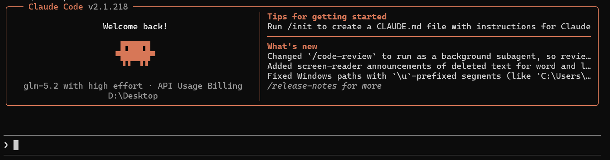

# Claude Code的安装及使用

Claude Code 是 Anthropic 推出的**终端/VS Code 双向 AI 编码工具**，是 Vib Coding 最适配的落地工具，依托 Claude 大模型强大的代码理解、逻辑推理、项目统筹能力，支持全项目维度的代码生成、修改、调试、重构，区别于普通代码补全工具，可独立完成完整业务功能开发。

## 一、安装过程

### 1、准备工作

在安装 Claude Code 之前，设备需提前安装 **Node.js 18+** 版本，国内需要配置镜像源，确保终端 **npm** 环境正常，这是 Claude Code 运行的基础依赖。

安装方式如下：

```bash
# 拉取 Node.js Docker 镜像：
docker pull node:24-alpine

# 创建 Node.js 容器并启动一个 Shell 会话：
docker run -it --rm --entrypoint sh node:24-alpine

# 验证 Node.js 版本：
node -v # Should print "v24.18.0".

# 验证 npm 版本：
npm -v # Should print "11.16.0".
```

安装完成后，执行下面的命令配置国内镜像源：

```bash
npm config set registry http://registry.npm.taobao.org/
```

当然，也可以选择其他镜像源，下面列出国内常用的几个镜像源：

- **阿里云**： https://registry.npmmirror.com
- **腾讯云**： https://mirrors.cloud.tencent.com/npm/
- **华为云**： https://mirrors.huaweicloud.com/repository/npm/
- **网易**： https://mirrors.163.com/npm/
- **清华大学开源镜像站**： https://mirrors.tuna.tsinghua.edu.cn/
- **中科大开源镜像站**： http://mirrors.ustc.edu.cn/

### 2、安装Claude Code

在需要的基础依赖安装完成后，执行下面的命令安装Claude Code：

```bash
npm install -g @anthropic-ai/claude-code
```

安装结束后，执行以下命令验证安装结果：

```bash
claude --version
```

---

## 二、配置过程

ClaudeCode本质是一个终端里面的智能开发工具，自己不产生智能，背后必须接一个大模型的服务；

安装结束后，需要进行基本的配置才能使用Claude Code。

### 1、需要配置的信息

此处选择火山引擎的 方舟Coding Plan 进行演示，进入控制台，生成APIkey并，并进入开发文档获取请求地址等信息。

需要配置以下三条信息：

1. **ANTHROPIC_BASE_URL：**请求地址，在模型的开发文档获取
2. **ANTHROPIC_AUTH_TOKEN：**后台生成的APIKey
3. **ANTHROPIC_MODEL:** 模型ID，在模型的开发文档内查看

### 2、配置方法

在用户文件夹下（C:\user\用户名\）的 `.claude` 文件夹中编辑或新增 `settings.json` 文件：

```json
{
    "env": {
        "ANTHROPIC_AUTH_TOKEN": "这里写APIkey",
        "ANTHROPIC_BASE_URL": "请求地址",
        "ANTHROPIC_MODEL": "模型ID"
    }
}
```

同样的位置，编辑或新增 `.claude.json` 文件，修改或新增 `hasCompletedOnboarding` 字段值为 `true`：

```json
{
  "hasCompletedOnboarding": true
}
```

---

## 三、使用

### 1、唤起Claude Code

打开PowerShell，使用cd命令切换到需要打开Claude Code的目录，输入Claude命令打开Claude Code：

```powershell
claude
```

启动成功则会显示：



### 2、安装插件：Claude HUD

**Claude HUD** 用于实时显示正在发生的事情，包括上下文使用率、活跃工具、运行中的 Agent 和待办进度等，这些信息始终在输入下方可见。

```bash
 [glm-5.2] │ Desktop                        ● high · /effort
 Context ░░░░░░░░░░ 0%
⏸manual mode on · ← for agents
```

该插件可以使用以下命令卸载：

```bash
/plugin remove claude-hud
```

### 3、模式选择

Claude Code内置了四种核心执行模式：**Default 默认模式、Auto 自动模式、Plan Mode 计划模式、Yolo 模式**，使用快捷键Shift+Tab更改模式。

**默认模式（Default）**：安全最高，逐次确认每一处代码修改，可控性强但效率低。

**自动模式（Auto）**：允许 Claude 直接修改文件并运行命令，无需逐项点击确认，适合信任模型时的高效操作，避免默认模式每次修改都要点击确认。

**计划模式（Plan Mode）**：探讨方案，只聊天不执行，仅分析代码、查找信息，不会实际修改你的本地文件。

**YOLO模式**：无多余确认、全自动改代码，效率最高、风险最大。处于YOLO模式下仍然可以使用 `shift+tab` 更改模式。

:warning:YOLO模式无法使用快捷键切出，需要使用以下命令开启，并需要二次确认：

```bash
claude --dangerously-skip-permissions
```

## 四、常用技巧

### 1、双击 Esc 回退对话

Claude Code中最常用、最重要的快捷键。给错指令，对 AI 的回答不满意等情况。双击 Esc 撤退到上一次操作。

仅按一次ESC为终止当前任务。

### 2、@引用文件

Claude Code虽然能自动读取项目文件，但显式地引用文件能让AI更准确地理解你的意图，也能避免AI读取不相关的文件浪费Token。

**引用文件：**`@src/utils.ts` 

**引用多个文件：**`@src/app.tsx @src/components/Header.tsx`

**引用目录：**`@src/components/`

**引用特定行（配合代码编辑器）：**`@src/utils.ts:45-60`

### 3、! 执行命令

Claude Code 内置了终端命令执行能力，在命令前加上 `!` 即可无需进行询问操作直接执行PowerShell命令。

#### 场景1：构建项目

!npm run build # 如果构建失败 构建报错了，帮我修复

#### 场景2：查看 Git 差异

!git diff # 然后让 Claude 解释变更内容 总结一下这些变更的主要内容

### 4、/init 自动生成配置

`/init` 是 Claude Code 最强大的命令之一。它能自动扫描你的项目，理解技术栈和结构，然后生成一份完整的 CLAUDE.md 配置文件。

`CLAUDE.md`是全局记忆的核心，是 Claude Code 的"项目记忆"，每次启动时，Claude 会自动读取这个文件，了解项目背景，建议新项目初始化后，立即运行 `/init`，然后根据实际情况调整生成的配置。

> Claude 会执行以下步骤：
>
> 1. 扫描项目结构：识别框架、语言、构建工具
> 2. 分析配置文件：读取 `package.json`、`tsconfig.json` 等
> 3. 检查代码风格：了解命名规范、文件组织方式
> 4. 生成 CLAUDE.md：创建包含项目信息的配置文件

**CLAUDE.md**示例：

```markdown
# My Project

## 技术栈
- 框架：Next.js 14 (App Router)
- 语言：TypeScript
- 样式：Tailwind CSS
- 状态管理：Zustand
- 数据库：Prisma + PostgreSQL

## 常用命令

\`\`\`bash
npm run dev      # 启动开发服务器
npm run build    # 生产构建
npm run test     # 运行测试
npx prisma migrate dev  # 数据库迁移
\`\`\`

## 代码规范
- 使用函数组件 + Hooks
- 文件命名：PascalCase（组件）、camelCase（工具函数）
- 提交规范：Conventional Commits
```

### 5、/compact 压缩上下文

Claude Code 的上下文窗口是有限的（通常 200K Token）。长对话会消耗大量 Token，不仅增加成本，还可能导致重要的早期信息被挤出上下文窗口。

`/compact` 会分析当前对话历史，提取关键信息（如已做出的决策、已生成的代码、已确认的需求），然后生成一份简洁的摘要。之后的对话基于这份摘要，而不是完整的历史记录。

#### /clear 和 /compact 的区别

| 命令     | 解释       | 使用场景                                       |
| -------- | ---------- | ---------------------------------------------- |
| /clear   | 清空上下文 | 如果需要重新开始，或者是感觉AI已经无法解决问题 |
| /compact | 压缩对话   | 重开对话，但是不希望丢掉之前的记忆             |

## 五、Claude Code的卸载

卸载（**需要以管理员身份运行PowerShell**）：

```bash
npm uninstall -g @anthropic-ai/claude-code
```

清理残留配置文件：删除 C:\Users\用户名\下的 `.claude` 文件夹 和 `.claude.json`

## 六、CC Switch工具的使用

CC Switch 是一款 Windows/macOS/Linux 通用的开源桌面管理工具，专门统一管控 Claude Code、Codex、Gemini CLI 等多款 AI 编程命令行工具，**无需手动修改配置文件**，可集中存储各类大模型 API 密钥、一键切换服务商与模型，还能统一管理 MCP 服务、技能插件、全局提示词，附带 Token 用量统计、代理优化、配置备份迁移、会话管理等功能，大幅简化多 AI 开发环境的切换与维护流程。

使用CC Switch，可无需手动修改配置文件。

开源地址：[https://github.com/farion1231/cc-switch/releases](https://www.tinsur.cn/?golink=aHR0cHM6Ly9naXRodWIuY29tL2ZhcmlvbjEyMzEvY2Mtc3dpdGNoL3JlbGVhc2Vz&nonce=a9b6559230)
