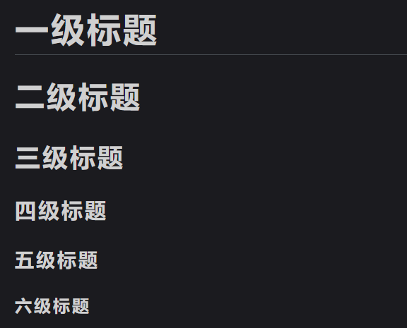
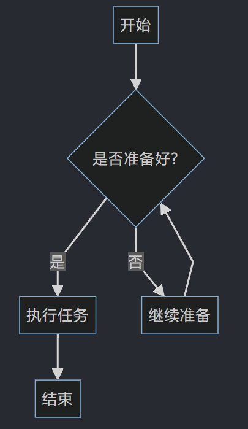
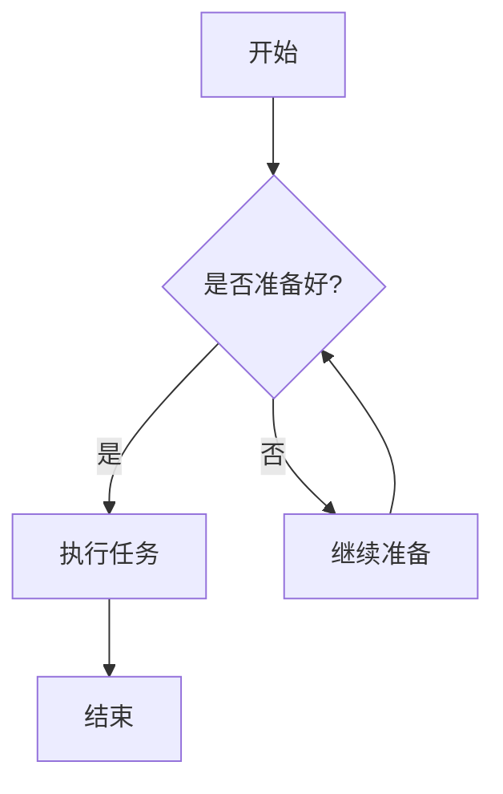
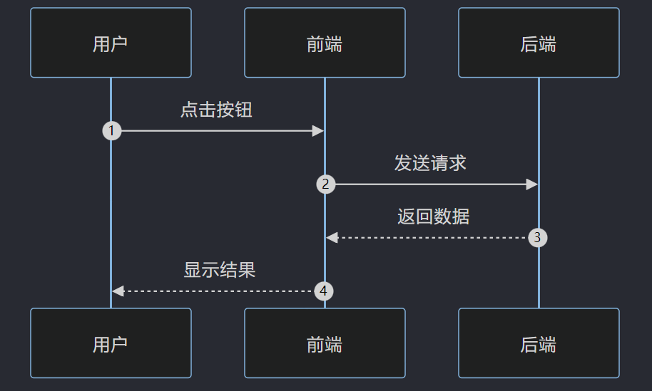
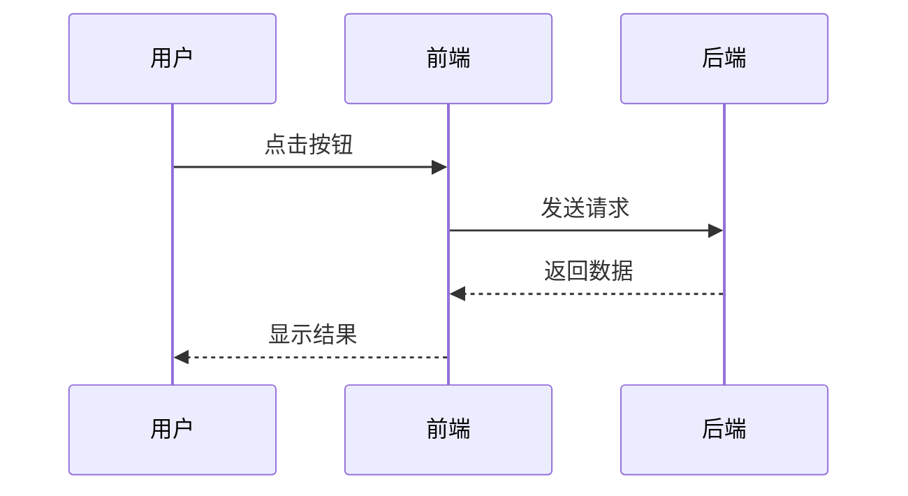

# 📝 Markdown 语法详细教程笔记

> Markdown 是一种轻量级标记语言,它允许人们使用易读易写的纯文本格式编写文档,然后转换成有效的 XHTML(或 HTML)文档。
>
> 本笔记涵盖了 Markdown 的全部常用语法,并为每种语法提供**演示效果**与**源码对照**,方便学习与查阅。
>
> :warning:**注意：本站 markdown 渲染可能不完全，会导致部分样式失效无法渲染，如有需要可前往笔记Github仓库（见笔记站首页）下载笔记源文件查看。**

---

## 📑 目录

1. [标题(Heading)](#一标题heading)
2. [段落与换行](#二段落与换行)
3. [文本样式](#三文本样式)
4. [列表](#四列表)
5. [引用](#五引用)
6. [代码](#六代码)
7. [分割线](#七分割线)
8. [链接](#八链接)
9. [图片](#九图片)
10. [表格](#十表格)
11. [任务列表](#十一任务列表)
12. [脚注](#十二脚注)
13. [删除线与高亮](#十三删除线与高亮)
14. [上下标](#十四上下标)
15. [表情符号 Emoji](#十五表情符号-emoji)
16. [转义字符](#十六转义字符)
17. [目录自动生成](#十七目录自动生成)
18. [数学公式](#十八数学公式)
19. [流程图 Mermaid](#十九流程图-mermaid)
20. [HTML 支持](#二十html-支持)
21. [快捷键速查表](#二十一快捷键速查表)
22. [结语](#结语)

---

## 一、标题(Heading)

使用 `#` 号可表示 1-6 级标题,一级标题对应一个 `#`,二级标题对应两个 `#`,以此类推。`#` 与标题文字之间需保留**一个空格**。

### 演示效果



### 源码对照

```markdown
# 一级标题
## 二级标题
### 三级标题
#### 四级标题
##### 五级标题
###### 六级标题
```

> 💡 **小贴士**:也可以用 `===`(一级)和 `---`(二级)写在文字下一行来表示标题,但 `#` 写法更常用。

```markdown
一级标题
=======

二级标题
-------
```

---

## 二、段落与换行

- **段落**:段落之间需要用一个**空行**分隔。
- **换行**:在行末加**两个空格**再回车,或者使用 `<br>` 标签可强制换行。

### 演示效果

这是第一段。这是第一段的第二句话。

这是第二段,与第一段之间有一个空行。

这是第三段的第一行。  
这是第三段的第二行(上一行末尾有两个空格)。

### 源码对照

```markdown
这是第一段。这是第一段的第二句话。

这是第二段,与第一段之间有一个空行。

这是第三段的第一行。  ←(行末有两个空格)
这是第三段的第二行(上一行末尾有两个空格)。
```

---

## 三、文本样式

Markdown 支持粗体、斜体、粗斜体等文本样式。

### 演示效果

- *斜体文本*  或  _斜体文本_
- **粗体文本**  或  __粗体文本__
- ***粗斜体文本***  或  ___粗斜体文本___
- `行内代码样式`
- <u>下划线文本</u>(使用 HTML 标签)

### 源码对照

```markdown
- *斜体文本*  或  _斜体文本_
- **粗体文本**  或  __粗体文本__
- ***粗斜体文本***  或  ___粗斜体文本___
- `行内代码样式`
- <u>下划线文本</u>(使用 HTML 标签)
```

> ⚠️ **注意**:`*` 与 `_` 均可使用,但建议在同一个文档中保持风格一致。粗斜体需要三个符号包裹。

---

## 四、列表

### 1. 无序列表

使用 `*`、`+` 或 `-` 作为列表标记,后面跟一个空格。

#### 演示效果

- 第一项
- 第二项
  - 第二项的子项(缩进两个空格)
  - 第二项的另一个子项
- 第三项

#### 源码对照

```markdown
- 第一项
- 第二项
  - 第二项的子项(缩进两个空格)
  - 第二项的另一个子项
- 第三项
```

### 2. 有序列表

使用数字加 `.` 号表示,后面跟一个空格。

#### 演示效果

1. 第一项
2. 第二项
   1. 第二项的子项(缩进三个空格)
   2. 第二项的另一个子项
3. 第三项

#### 源码对照

```markdown
1. 第一项
2. 第二项
   1. 第二项的子项(缩进三个空格)
   2. 第二项的另一个子项
3. 第三项
```

> 💡 **小贴士**:有序列表的数字其实不需要按顺序排列,Markdown 渲染器会自动按顺序生成编号。例如全部写 `1.` 也会输出 1、2、3。


---

## 五、引用

使用 `>` 符号表示引用,后面跟一个空格。引用支持多级嵌套、多段落,也可包含其他 Markdown 元素。

### 演示效果

> 这是一个引用段落。
>
> 这是同一个引用的第二段(中间留一个空行,每行都要带 `>`)。
>
> > 这是嵌套的二级引用。
> >
> > > 这是嵌套的三级引用。

> 引用中也可以使用 **粗体**、*斜体*、`代码`、[链接](https://example.com) 等。

### 源码对照

```markdown
> 这是一个引用段落。
>
> 这是同一个引用的第二段(中间留一个空行,每行都要带 `>`)。
>
> > 这是嵌套的二级引用。
> >
> > > 这是嵌套的三级引用。

> 引用中也可以使用 **粗体**、*斜体*、`代码`、[链接](https://example.com) 等。
```

---

## 六、代码

### 1. 行内代码

用反引号 `` ` `` 包裹。

#### 演示效果

在终端输入 `npm install` 来安装依赖,使用 `Ctrl + C` 复制。

#### 源码对照

```markdown
在终端输入 `npm install` 来安装依赖,使用 `Ctrl + C` 复制。
```

### 2. 代码块

用三个反引号 ` ``` ` 包裹,可在开头反引号后指定语言以启用语法高亮。

#### 演示效果

```javascript
// JavaScript 代码
function greet(name) {
  console.log(`Hello, ${name}!`);
}
greet('Markdown');
```

```python
# Python 代码
def greet(name):
    print(f"Hello, {name}!")

greet("Markdown")
```

```html
<!-- HTML 代码 -->
<div class="container">
  <h1>Hello Markdown</h1>
</div>
```

#### 源码对照

````markdown
```javascript
// JavaScript 代码
function greet(name) {
  console.log(`Hello, ${name}!`);
}
greet('Markdown');
```

```python
# Python 代码
def greet(name):
    print(f"Hello, {name}!")

greet("Markdown")
```

```html
<!-- HTML 代码 -->
<div class="container">
  <h1>Hello Markdown</h1>
</div>
```
````

> 💡 **小贴士**:如果代码块内部本身包含三个反引号,可以用四个或更多反引号来包裹外层代码块(如上方演示源码使用了四个反引号)。

---

## 七、分割线

使用三个或以上的 `*`、`-` 或 `_`,且行内不能有其他内容。

### 演示效果

文字上方

---

文字下方

### 源码对照

```markdown
文字上方

---

文字下方
```

> ⚠️ **注意**:使用 `---` 时,需确保其上方有空行,否则可能被识别为二级标题(标题的另一种语法)。

---

## 八、链接

### 1. 行内式链接

#### 演示效果

欢迎访问 [GitHub](https://github.com) 和 [百度](https://www.baidu.com)。

带标题的链接: [GitHub](https://github.com "GitHub 官网")。

#### 源码对照

```markdown
欢迎访问 [GitHub](https://github.com) 和 [百度](https://www.baidu.com)。

带标题的链接: [GitHub](https://github.com "GitHub 官网")。
```

### 2. 参考式链接

参考式链接由两部分组成:正文中的链接标记和文档任意位置的链接定义。

#### 演示效果

这是一个 [参考式链接示例][ref-link],链接定义放在文档其他位置。

[ref-link]: https://www.example.com "示例网站"

#### 源码对照

```markdown
这是一个 [参考式链接示例][ref-link],链接定义放在文档其他位置。

[ref-link]: https://www.example.com "示例网站"
```

### 3. 自动链接

直接写 URL 或邮箱,渲染器会自动转为可点击链接。

#### 演示效果

https://www.github.com

user@example.com

#### 源码对照

```markdown
https://www.github.com

user@example.com
```

### 4. 页内锚点链接

通过 `[文字](#锚点)` 跳转到文档内的标题。锚点一般为标题转小写、空格替换为连字符。

#### 演示效果

跳转到 [目录](#📑-目录)

#### 源码对照

```markdown
跳转到 [目录](#📑-目录)
```

---

## 九、图片

### 1. 行内式图片

语法:``

#### 演示效果


#### 源码对照

```markdown

```

### 2. 参考式图片

#### 演示效果

![Markdown Logo][logo]

[logo]: https://markdown.com.cn/images/markdown-logo.png "Markdown Logo"

#### 源码对照

```markdown
![Markdown Logo][logo]

[logo]: https://markdown.com.cn/images/markdown-logo.png "Markdown Logo"
```

### 3. 带链接的图片

将图片语法放在链接语法的方括号部分即可。

#### 演示效果

[](https://markdown.com.cn)

#### 源码对照

```markdown
[](https://markdown.com.cn)
```

### 4. 调整图片大小

Markdown 原生不支持调整图片大小,可借助 HTML `` 标签实现。

#### 源码对照

```markdown

```

---

## 十、表格

使用 `|` 分隔列,使用 `-` 分隔表头和内容。`:` 可控制对齐方式。

- `:---` 左对齐
- `:---:` 居中对齐
- `---:` 右对齐

### 演示效果

| 姓名   | 年龄 | 职业      |
| ------ | :--: | --------: |
| 张三   |  25  | 工程师    |
| 李四   |  30  | 设计师    |
| 王五   |  28  | 产品经理  |

### 源码对照

```markdown
| 姓名   | 年龄 | 职业      |
| ------ | :--: | --------: |
| 张三   |  25  | 工程师    |
| 李四   |  30  | 设计师    |
| 王五   |  28  | 产品经理  |
```

### 表格内使用其他语法

表格单元格内可以使用行内格式(粗体、斜体、代码、链接等)。

#### 演示效果

| 功能     | 语法             | 说明                       |
| -------- | ---------------- | -------------------------- |
| **粗体** | `**文字**`       | 加粗显示                   |
| *斜体*   | `*文字*`         | 倾斜显示                   |
| [链接](https://github.com) | `[文字](url)` | 超链接 |

#### 源码对照

```markdown
| 功能     | 语法             | 说明                       |
| -------- | ---------------- | -------------------------- |
| **粗体** | `**文字**`       | 加粗显示                   |
| *斜体*   | `*文字*`         | 倾斜显示                   |
| [链接](https://github.com) | `[文字](url)` | 超链接 |
```

> 💡 **小贴士**:最外层的 `|` 可以省略,但保留更清晰。表格内不支持标题、块级元素(代码块、列表等)。

---

## 十一、任务列表

任务列表用于呈现可勾选的待办事项,使用 `- [ ]` 和 `- [x]` 表示未完成与已完成。

### 演示效果

- [x] 学习 Markdown 基础语法
- [x] 掌握表格与列表
- [ ] 编写一份完整的笔记
- [ ] 实际应用到项目中

### 源码对照

```markdown
- [x] 学习 Markdown 基础语法
- [x] 掌握表格与列表
- [ ] 编写一份完整的笔记
- [ ] 实际应用到项目中
```

---

## 十二、脚注

脚注用于在文档底部添加注释,正文中以 `[^标识]` 标记,在文档任意位置定义脚注内容。

### 演示效果

Markdown 是一种轻量级标记语言[^1],它由 John Gruber 设计[^2]。

[^1]: 轻量级标记语言指用纯文本格式编写、可转换为 HTML 等格式的语言。

[^2]: John Gruber 于 2004 年发布了 Markdown 的首个版本。

### 源码对照

```markdown
Markdown 是一种轻量级标记语言[^1],它由 John Gruber 设计[^2]。

[^1]: 轻量级标记语言指用纯文本格式编写、可转换为 HTML 等格式的语言。

[^2]: John Gruber 于 2004 年发布了 Markdown 的首个版本。
```

---

## 十三、删除线与高亮

### 1. 删除线

使用两根波浪线 `~~` 包裹。

#### 演示效果

~~这是一段被删除的文字。~~

#### 源码对照

```markdown
~~这是一段被删除的文字。~~
```

### 2. 高亮(GitHub Flavored Markdown 扩展)

使用两根等号 `==` 包裹(部分平台支持,如 Typora、Obsidian)。

#### 演示效果

==这是一段被高亮的文字。==

#### 源码对照

```markdown
==这是一段被高亮的文字。==
```

> ⚠️ **注意**:高亮语法为扩展语法,并非所有 Markdown 渲染器都支持。若不支持,可使用 HTML 标签 `<mark>文字</mark>` 替代。

---

## 十四、上下标

上下标为扩展语法,部分渲染器(如 Typora、Obsidian)支持。

### 演示效果

- 上标:H~2~O 是水,E = mc^2^
- 上标写法 2:X<sup>2</sup> + Y<sup>2</sup> = Z<sup>2</sup>
- 下标写法 2:CO<sub>2</sub> 是二氧化碳

### 源码对照

```markdown
- 上标:H~2~O 是水,E = mc^2^
- 上标写法 2:X<sup>2</sup> + Y<sup>2</sup> = Z<sup>2</sup>
- 下标写法 2:CO<sub>2</sub> 是二氧化碳
```

> 💡 **小贴士**:`~下标~` 和 `^上标^` 是 Typora 风格的扩展语法;`<sup>` 与 `<sub>` 是 HTML 标签,兼容性更好。

---

## 十五、表情符号 Emoji

使用 `:表情名:` 语法,或直接复制粘贴 Emoji 字符。

### 演示效果

直接使用 Emoji:🎉 🚀 ❤️ 📌 ✅ ❌

使用冒号语法(部分平台支持): :smile: :heart: :thumbsup: :rocket: :tada:

### 源码对照

```markdown
直接使用 Emoji:🎉 🚀 ❤️ 📌 ✅ ❌

使用冒号语法(部分平台支持): :smile: :heart: :thumbsup: :rocket: :tada:
```

---

## 十六、转义字符

Markdown 使用反斜杠 `\` 转义特殊字符,使其显示为普通字符。

### 需要转义的常用字符

| 字符 | 名称       | 字符 | 名称     |
| :--: | ---------- | :--: | -------- |
|  \\  | 反斜杠     |  \`  | 反引号   |
|  \*  | 星号       |  \_  | 下划线   |
|  \{  | 花括号     |  \}  | 花括号   |
|  \[  | 方括号     |  \]  | 方括号   |
|  \(  | 圆括号     |  \)  | 圆括号   |
|  \#  | 井号       |  \+  | 加号     |
|  \-  | 减号       |  \.  | 句点     |
|  \!  | 感叹号     |  \|  | 竖线     |

### 演示效果

\* 这里的星号不会变成斜体 \*

\# 这里的井号不会变成标题

\> 这里的尖括号不会变成引用

### 源码对照

```markdown
\* 这里的星号不会变成斜体 \*

\# 这里的井号不会变成标题

\> 这里的尖括号不会变成引用
```

---

## 十七、目录自动生成

部分平台(GitHub、Typora、Obsidian 等)支持通过特定标记自动生成目录。

### 演示效果(在 Typora 中输入后会自动展开)

```markdown
[TOC]
```

或手动编写目录,并使用锚点链接跳转(本文档开头即采用此方式):

```markdown
- [标题](#一标题heading)
- [段落与换行](#二段落与换行)
```

---

## 十八、数学公式

使用 LaTeX 语法编写公式。`$...$` 为行内公式,`$$...$$` 为块级公式(需渲染器支持,如 Typora、Obsidian、KaTeX)。

### 演示效果

行内公式:质能方程 $E = mc^2$ 是爱因斯坦提出的。

块级公式:

$$
\frac{-b \pm \sqrt{b^2 - 4ac}}{2a}
$$

矩阵:

$$
\begin{bmatrix}
1 & 2 & 3 \\
4 & 5 & 6 \\
7 & 8 & 9
\end{bmatrix}
$$

求和与积分:

$$
\sum_{i=1}^{n} i = \frac{n(n+1)}{2}, \quad \int_{0}^{\infty} e^{-x^2} dx = \frac{\sqrt{\pi}}{2}
$$

### 源码对照

```markdown
行内公式:质能方程 $E = mc^2$ 是爱因斯坦提出的。

块级公式:

$$
\frac{-b \pm \sqrt{b^2 - 4ac}}{2a}
$$

矩阵:

$$
\begin{bmatrix}
1 & 2 & 3 \\
4 & 5 & 6 \\
7 & 8 & 9
\end{bmatrix}
$$

求和与积分:

$$
\sum_{i=1}^{n} i = \frac{n(n+1)}{2}, \quad \int_{0}^{\infty} e^{-x^2} dx = \frac{\sqrt{\pi}}{2}
$$
```

---

## 十九、流程图 Mermaid

Mermaid 是一种基于文本的图表绘制工具,可在 Markdown 中绘制流程图、时序图、甘特图等(需渲染器支持,如 GitHub、Typora、Obsidian)。

### 1. 流程图

#### 演示效果



#### 源码对照

````markdown

````

### 2. 时序图

#### 演示效果



#### 源码对照

````markdown

````

### 3. 甘特图

````markdown
```mermaid
gantt
    title 项目开发计划
    dateFormat  YYYY-MM-DD
    section 设计阶段
    需求分析      :a1, 2026-07-01, 7d
    原型设计      :after a1, 5d
    section 开发阶段
    前端开发      :2026-07-13, 10d
    后端开发      :2026-07-13, 12d
    section 测试上线
    测试          :2026-07-25, 5d
    上线          :after 测试, 2d
```
````

---

## 二十、HTML 支持

Markdown 支持直接嵌入 HTML 标签,以实现更丰富的排版效果。

### 1. 折叠区块 details

#### 演示效果

<details>
<summary>点击查看详情</summary>

这里是折叠的内容。可以放置**任何** Markdown 内容。

- 列表项一
- 列表项二

```python
print("也可以放代码块")
```

</details>

#### 源码对照

```html
<details>
<summary>点击查看详情</summary>

这里是折叠的内容。可以放置**任何** Markdown 内容。

- 列表项一
- 列表项二

```python
print("也可以放代码块")
```

</details>
```

### 2. 文字颜色与居中

#### 演示效果

<span style="color: red;">红色文字</span>
<span style="color: #0969da; font-weight: bold;">蓝色加粗文字</span>

<div align="center">居中显示的文字</div>

<div align="right">右对齐的文字</div>

#### 源码对照

```html
<span style="color: red;">红色文字</span>
<span style="color: #0969da; font-weight: bold;">蓝色加粗文字</span>

<div align="center">居中显示的文字</div>

<div align="right">右对齐的文字</div>
```

### 3. 提示框 / 键盘按键

#### 演示效果

<kbd>Ctrl</kbd> + <kbd>C</kbd> 复制,<kbd>Ctrl</kbd> + <kbd>V</kbd> 粘贴。

#### 源码对照

```html
<kbd>Ctrl</kbd> + <kbd>C</kbd> 复制,<kbd>Ctrl</kbd> + <kbd>V</kbd> 粘贴。
```

### 4. 锚点跳转(HTML 方式)

```html
<a href="#📑-目录">回到目录</a>
```

---

## 二十一、快捷键速查表

以下是常用 Markdown 编辑器(如 Typora)的快捷键,提高写作效率。

| 功能       | 快捷键(Windows)  | 快捷键(Mac)      |
| ---------- | ------------------ | ------------------ |
| 加粗       | `Ctrl + B`         | `Cmd + B`          |
| 斜体       | `Ctrl + I`         | `Cmd + I`          |
| 行内代码   | `` Ctrl + ` ``     | `` Cmd + ` ``      |
| 插入链接   | `Ctrl + K`         | `Cmd + K`          |
| 插入图片   | `Ctrl + Shift + I` | `Cmd + Ctrl + I`   |
| 一级标题   | `Ctrl + 1`         | `Cmd + 1`          |
| 二级标题   | `Ctrl + 2`         | `Cmd + 2`          |
| 插入表格   | `Ctrl + T`         | `Cmd + T`          |
| 引用       | `Ctrl + Shift + Q` | `Cmd + Shift + Q`  |
| 代码块     | `Ctrl + Shift + K` | `Cmd + Shift + K`  |
| 查找       | `Ctrl + F`         | `Cmd + F`          |
| 撤销       | `Ctrl + Z`         | `Cmd + Z`          |

---

## 📌 结语

本笔记涵盖了 Markdown 的常用语法，从基础的标题、文本样式到高级的数学公式、Mermaid 图表等。掌握这些语法后，你可以高效地编写结构清晰、排版美观的文档。

> 📎 **推荐编辑器**:Typora、Obsidian、VS Code(配合 Markdown 插件)、MarkText 等。
>
> 📎 **推荐参考**:
> - [Markdown 官方教程](https://markdown.com.cn)
> - [GitHub Markdown 指南](https://docs.github.com/zh/get-started/writing-on-github)
> - [CommonMark 规范](https://commonmark.org)

---

<p align="center"><em>Happy Writing with Markdown! ✨</em></p>
